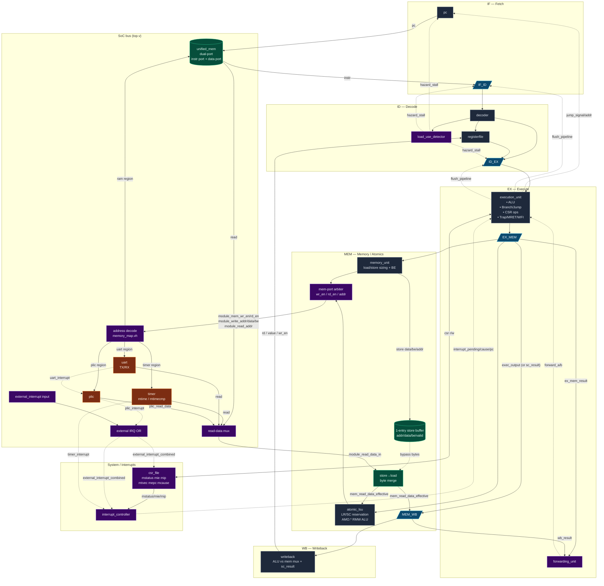
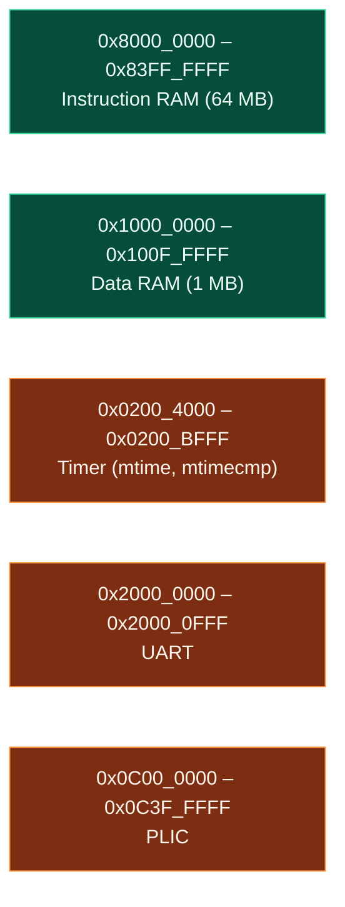
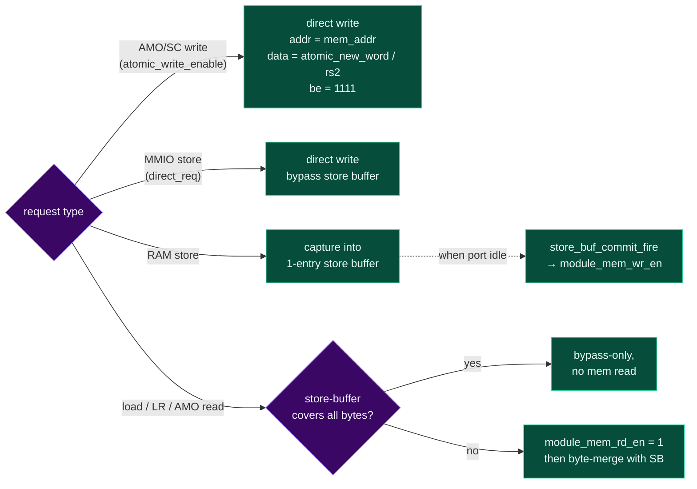

## Synapse-32 Architecture

5-stage in-order RISC-V pipeline (RV32IMA + Zicsr + Zifencei + Zihintpause, with machine/supervisor traps and interrupts) with a unified instruction/data RAM, MMIO timer + UART + PLIC, a 1-entry store buffer with store→load byte-merge, and an atomic LSU for LR/SC and AMO.* operations.

### Full system

### Memory map (`rtl/include/memory_map.vh`)

Both RAM regions are backed by a single `unified_mem`, instantiated in `rtl/top.v` with `MEM_SIZE(17039360)`: 17,039,360 × 32-bit words, or 64 MB of instruction RAM plus 1 MB of data RAM. The instruction port serves fetches; the data port serves loads/stores after address translation. `rtl/mmu/unified_mem.v` maps the instruction region to local byte offsets `[0 .. INSTR_MEM_SIZE-1]` and the data region to `[INSTR_MEM_SIZE .. INSTR_MEM_SIZE+DATA_MEM_SIZE-1]`. Dividing these byte offsets by four gives instruction word indices `0..16,777,215` and data word indices `16,777,216..17,039,359`.

### Memory-port arbitration (MEM stage)

A standard RAM store is parked in the 1-entry store buffer for one cycle and committed when the memory port isn't otherwise busy. AMO/SC writes and MMIO stores are driven directly. Loads (and LR/AMO reads) check the store buffer per byte; if all required bytes are covered they're served from the buffer, otherwise the memory read happens and pending bytes are merged on top.

### Notes on the atomic path
- `atomic_lsu` (`rtl/core_modules/atomic_lsu.v`) holds the LR reservation (`lr_valid`, `lr_addr`) and computes the AMO read-modify-write value combinationally from `mem_read_data_effective` and `rs2`.
- The reservation is killed by any `SC.W`, any `AMO.*`, or by another store hitting `lr_addr`.
- `SC.W` writes `0` (success) or `1` (failure) into `rd` via `sc_result`, which is muxed into the `MEM_WB` `exec_output` field.

### File map
| Block | File |
| --- | --- |
| Top SoC | `rtl/top.v` |
| CPU core | `rtl/riscv_cpu.v` |
| Pipeline regs | `rtl/pipeline_stages/{IF_ID,ID_EX,EX_MEM,MEM_WB}.v` |
| Hazard / forwarding | `rtl/pipeline_stages/{load_use_detector,forwarding_unit,store_load_detector}.v` |
| ALU / decode / RF / PC | `rtl/core_modules/{alu,decoder,registerfile,pc}.v` |
| Execute wrapper | `rtl/execution_unit.v` |
| LSU | `rtl/memory_unit.v`, `rtl/core_modules/atomic_lsu.v` |
| Writeback | `rtl/writeback.v` |
| CSR / IRQ | `rtl/core_modules/{csr_file,csr_exec,interrupt_controller}.v` |
| MMIO | `rtl/core_modules/{timer,uart,plic}.v` |
| Memory | `rtl/mmu/unified_mem.v` (17,039,360 × 32-bit words) |
| Address map | `rtl/include/memory_map.vh` |
