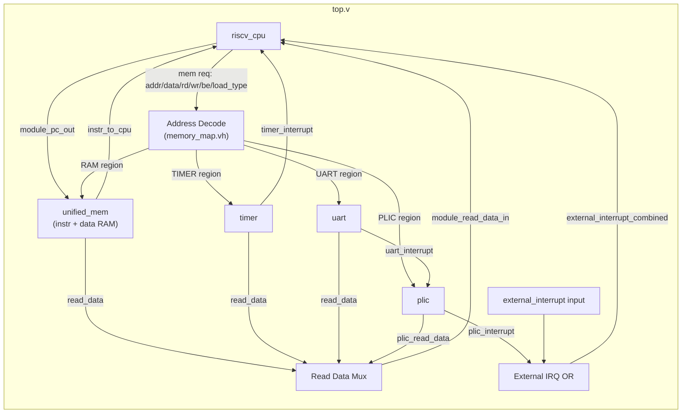
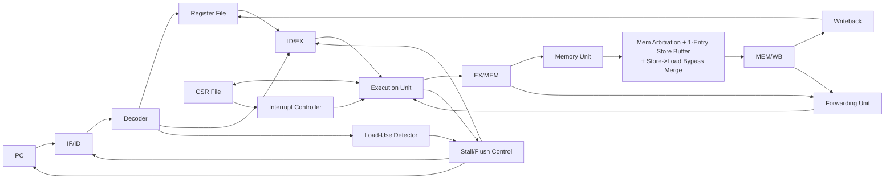
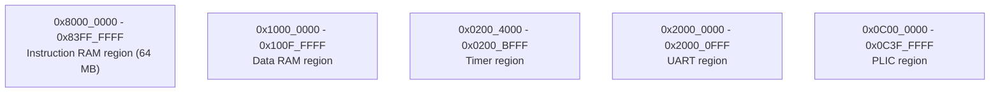

# Synapse-32 System Diagram

This document describes the current top-level SoC wiring and CPU microarchitecture.

## Top-Level SoC (`top.v`)

```mermaid
flowchart LR
    subgraph TOP["top.v"]
        CPU["riscv_cpu"]
        DECODE["Address Decode\n(memory_map.vh)"]
        RMUX["Read Data Mux"]
        UMEM["unified_mem\n(instr + data RAM)"]
        TIMER["timer"]
        UART["uart"]
        PLIC["plic"]
        IRQ_OR["External IRQ OR"]
        EXT_IRQ["external_interrupt input"]
    end

    CPU -- "module_pc_out" --> UMEM
    UMEM -- "instr_to_cpu" --> CPU

    CPU -- "mem req: addr/data/rd/wr/be/load_type" --> DECODE
    DECODE -- "RAM region" --> UMEM
    DECODE -- "TIMER region" --> TIMER
    DECODE -- "UART region" --> UART
    DECODE -- "PLIC region" --> PLIC

    UMEM -- "read_data" --> RMUX
    TIMER -- "read_data" --> RMUX
    UART -- "read_data" --> RMUX
    PLIC -- "plic_read_data" --> RMUX
    RMUX -- "module_read_data_in" --> CPU

    TIMER -- "timer_interrupt" --> CPU
    UART -- "uart_interrupt" --> PLIC
    PLIC -- "plic_interrupt" --> IRQ_OR
    EXT_IRQ --> IRQ_OR
    IRQ_OR -- "external_interrupt_combined" --> CPU
```

## CPU Datapath (`riscv_cpu.v`)

```mermaid
flowchart LR
    PC["PC"] --> IFID["IF/ID"]
    IFID --> DEC["Decoder"]
    DEC --> RF["Register File"]
    RF --> IDEX["ID/EX"]
    DEC --> IDEX

    LUD["Load-Use Detector"] --> STALL["Stall/Flush Control"]
    DEC --> LUD
    IDEX --> EXU["Execution Unit"]
    FWD["Forwarding Unit"] --> EXU
    EXU --> EXMEM["EX/MEM"]
    EXMEM --> MEMU["Memory Unit"]

    MEMU --> LSU["Mem Arbitration + 1-Entry Store Buffer\n+ Store->Load Bypass Merge"]
    LSU --> MEMWB["MEM/WB"]
    MEMWB --> WB["Writeback"]
    WB --> RF

    EXMEM --> FWD
    MEMWB --> FWD

    EXU --> STALL
    STALL --> PC
    STALL --> IFID
    STALL --> IDEX

    CSR["CSR File"] <--> EXU
    INTC["Interrupt Controller"] --> EXU
    CSR --> INTC
```

## Memory Regions

```mermaid
flowchart TB
    M0["0x8000_0000 - 0x83FF_FFFF\nInstruction RAM region (64 MB)"]
    M1["0x1000_0000 - 0x100F_FFFF\nData RAM region"]
    M2["0x0200_4000 - 0x0200_BFFF\nTimer region"]
    M3["0x2000_0000 - 0x2000_0FFF\nUART region"]
    M4["0x0C00_0000 - 0x0C3F_FFFF\nPLIC region"]
```

